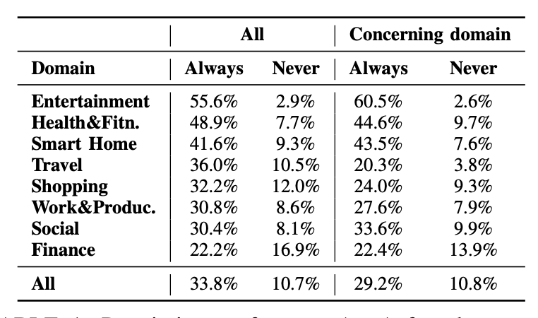
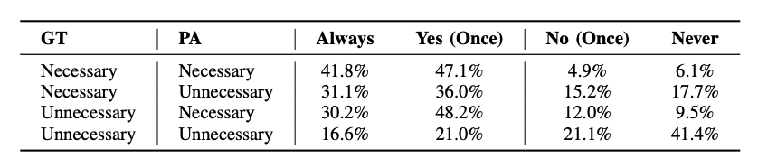
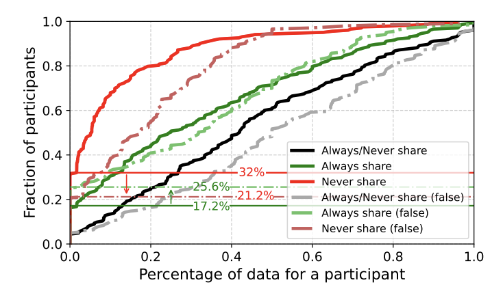
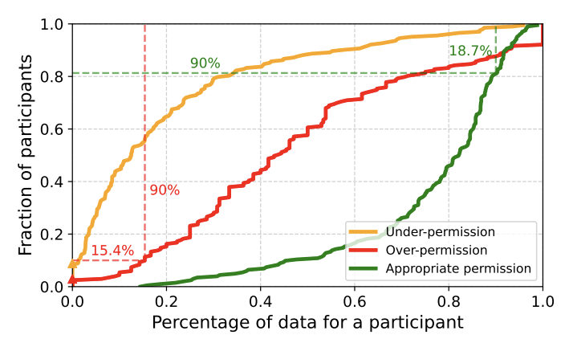
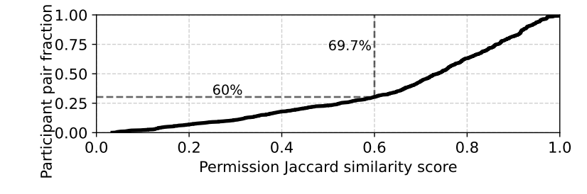
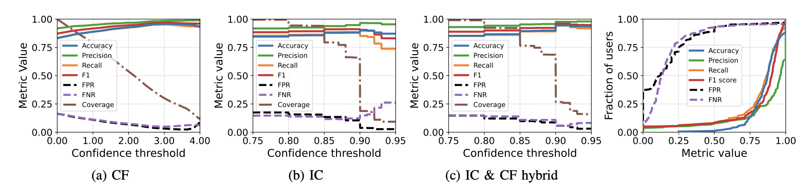

**저자:** Yuhao Wu 외 5인

**소속:** Washington University in St. Louis, UC Irvine, University of Washington, Georgetown University

**학회명:** 2026 IEEE Symposium on Security and Privacy

**공개일:** 2025.11.22

# 논문 선정 이유

AI 에이전트가 발전함에 따라 AI 에이전트 스스로 수행할 수 있는 작업의 범위가 점점 더 넓어지고 있다. 이전에는 사용자의 질문에 답을 하는 정도에 그쳤지만 이제는 컴퓨터를 스스로 조작해 파일을 생성, 수정, 삭제하거나 프로그램을 다운 받는 등 정말 많은 작업을 수행할 수 있게 되었다. 하지만 AI 에이전트는 항상 사용자가 원하는 작업만을 수행하지 않으며, AI 에이전트가 할 수 있는 작업이 늘어남에 따라 그로 인해 발생할 수 있는 위험도 훨씬 많아졌다. 적어도 AI로 발생하는 ‘치명적인’ 위험을 피하기 위해서는 적절한 권한 설정이 중요하다고 생각하고 있다. 하지만 나도 Codex와 같은 AI 에이전트를 자주 사용하면서도 적절한 권한 설정을 하고 있지 않다고 생각한다. 고민하면서도 언제나 찝찝함을 느끼면서도 full access를 허용하게 되는 자신을 돌아보며 좀더 쉽게 권한 설정을 할 수 있는 방법에 대한 논문이라고 생각해서 선정하게 되었다.

# Introduction

- 연구 배경
    - AI 에이전트만을 위한 권한 관리 시스템이 필요하다.
- 기존 방식의 한계
    - 기존 시스템의 설치 시점 권한 부여 방식은 실행 계획이 동적으로 만들어진다는 AI 에이전트 특성 상 지나치게 넓은 권한을 허용하거나 실제 상황에 맞지 않는 결정을 유도할 수 있다.
    - 기존 시스템의 런타임 권한 부여 방식은 하나의 작업을 수행하는 과정에서 여러 도구와 데이터에 연속적으로 접근할 수도 있는 AI 에이전트 특성 상 사용자의 작업 흐름이 반복적으로 중단될 수 있다.
    - 기존 모델은 이전에 보지 못한 데이터 유형이나 작업 과정에 유연하게 대응하기 어렵다.
    - 외부 도구가 필요 이상의 많은 데이터를 요구하거나 AI 에이전트가 자연어를 잘못 해석하는 등 동적인 위험을 세밀하게 통제하기 어렵다.
- 제안하는 해결법
    - AI 에이전트의 데이터 접근 권한을 자동으로 관리하는 권한 보조자를 개발한다.

# Methodology1: 연구 설계

- 저자들은 AI 에이전트가 실제로 사용자를 대신해 작업을 수행하는 상황을 가정하기 위해 비네트 기반 사용자 연구를 진행했다.
- 대상
    - 미국 연구 참여자 모집 사이트인 Prolific에서 205명의 지원자이다.
- 시나리오
    - 미래형 AI 개인 비서를 훈련시키는 사용자로 가정한다.
- 참여자는 세 가지 유형의 선택을 한다.
    - 사용자 요청을 해결하기 위해 어떤 도구가 필요한지 선택한다.
    - 요청 해결에 필요한 데이터를 선택한다.
    - 해당 데이터에 AI 에이전트나 도구가 접근해도 되는지 권한을 결정한다.
- 권한 결정 선택지
    - Yes, always share (항상 공유)
    - Yes, but ask me next time (일회성 공유)
    - No, but ask me next time (일회성 거부)
    - No never share (항상 거부)
    - 항상 공유와 항상 거부 비율
    
    
    
- 도메인
    - 엔터테인먼트
    - 건강 및 피트니스
    - 스마트홈
    - 여행
    - 쇼핑
    - 업무 및 생산성
    - 소셜
    - 금융
- AI 에이전트가 항상 올바르게 행동한다고 가정하지 않는다.
    - 권한 결정 질문의 25%에 불필요한 데이터 유형을 포함시켰다.
- 정리
    
    
    | **항목** | **내용** |
    | --- | --- |
    | 참여자 수 | 205명, 유효 응답 기준 |
    | 모집 플랫폼 | Prolific |
    | 도메인 수 | 8개 |
    | 도구 수 | 21개 |
    | 질문 수 | 65개 |
    | 고유 데이터 유형 | 142개 |
    | 일반화된 데이터 유형 | 75개 |
    | 권한 결정 질문 | 20개 |
    | 도구/데이터 선택 질문 | 5개 |

# Methodology2: 권한 선호 분석

- 수집된 응답을 분석하여 사용자의 권한 결정에 영향을 미치는 요인을 분석했다.
- 분석 기준
    
    
    | **분석 기준** | **확인하려는 내용** |
    | --- | --- |
    | 에이전트 실수 여부 | 불필요한 데이터가 포함되면 사용자가 더 조심하는가 |
    | 과잉/과소 권한 부여 | 사용자가 필요한 데이터만 적절히 공유하는가 |
    | 도메인/맥락 | 금융, 여행, 엔터테인먼트 등 맥락에 따라 선호가 달라지는가 |
    | 데이터 민감도 | SSN, 여권, 계좌 정보 같은 민감 데이터에 더 보수적인가 |
    | 사용자 특성 | 나이, AI 신뢰도, 프라이버시 의식 등이 영향을 주는가 |
    | 선호 일관성 | 같은 사용자 또는 비슷한 사용자 간 패턴이 존재하는가 |
- AI 에이전트가 실수하면 사용자는 더 보수적으로 행동한다.
    - AI 에이전트가 불필요한 데이터를 함께 제시했을 때, ‘항상 공유’를 한 번도 선택하지 않은 참여자의 비율이 17.2%에서 25.6%로 증가했다.
    - 사용자가 데이터 필요성을 맞게 또는 틀리게 판단했을 때 권한 선택
        
        
        
    - 참여자의 권한 선호 분포. 필요한 데이터 vs 불필요한 데이터가 포함된 경우 비교
        
        
        
- 과잉 권한 부여가 과소 권한 부여보다 흔하다.
    - 참여자의 90%는 받은 데이터 공유 요청 중 16.4%이상에서 과잉 권한을 부여했다.
    - 과소 권한, 과잉 권한, 적절한 권한 비율 분포
        
        
        
- 사용자는 민감 데이터에 더 조심스럽게 반응한다.
    - 엔터테인먼트 도메인에서는 ‘항상 공유’ 응답 비율이 55.6%로 가장 높았지만, 금융 도메인에서는 22.2%로 가장 낮았다.
    - 아이 이름은 65.1%의 사용자가 공유하지 않았지만, 미팅 세부사항 같이 비교적 덜 민감한 데이터는 공유를 선택한 사용자의 비율이 98.4%로 높았다.
- 사용자의 권한 선호에는 일관성이 있다.
    - 예를 들어, 엔터테인먼트와 스마트홈 도메인에서는 84.5~85.6%의 참여자가 해당 도메인 안의 데이터 권한을 일관되게 허용하거나 거부했다.
- 사용자 간에도 유사한 권한 패턴이 관찰된다.
    - 전체 참여자의 46.3%는 도메인별 권한 허용률의 표준편차가 0.1 미만이었고, 73.4%는 0.2 미만이었다. 또한 같은 권한 요청에 답한 참여자 쌍의 69.7%는 데이터 유형의 60% 이상에서 유사한 데이터 공유 선호를 보였다.
    - 사용자 쌍 간 권한 선호 Jaccard 유사도
        
        
        
- 사용자의 권한 결정이 완전히 무작위적이지 않다. 즉, 이후 권한 예측 모델을 설계하기 위한 근거가 될 수 있다.

# Methodology2: 권한 예측 모델 설계

- 사용자 연구 결과를 바탕으로, 사용자의 향후 권한 결정을 예측하는 모델을 설계한다.
- 모델
    - IC 모델: LLM 인컨텍스트 학습으로 개인 사용자 이력을 기반으로 예측한다.
    - CF 모델: 협업 필터링으로 유사 사용자 패턴을 활용한다.
    - Hybrid 모델: IC와 CF 결합한 모델로, 개인 선호와 유사 사용자 패턴을 함께 반영한다.
- IC 모델
    - LLM에게 사용자의 정보를 자연어 프롬프트로 제공하고, 새로운 데이터 공유 요청에 대해 사용자가 허용할지, 거부할지 예측하게 한다.
    - 입력 정보
        
        
        | **입력 정보** | **예시** |
        | --- | --- |
        | 인구통계 | 나이, 성별, 교육 수준 |
        | AI 사용 경험 | AI 친숙도, 사용 빈도, AI 신뢰도 |
        | 프라이버시 태도 | 프라이버시 의식 수준, 우려 도메인 |
        | 권한 이력 | 과거 질의, 도구, 데이터 유형, 사용자의 결정 |
    - 장점: 이전에 보지 못한 데이터 유형이나 새로운 상황에도 비교적 유연하게 대응할 수 있다
    - 단점: 권한 부여 이력이 부족하면 정확도가 확연히 떨어진다.
- CF 모델
    - 협업 필터링을 사용하여 비슷한 사용자들이 과거에 어떤 선택을 했는지를 바탕으로 현재 사용자의 선택을 예측한다.
    - 논문은 LightGCN이라는 그래프 기반 협업 필터링 모델을 사용한다.
    - 장점: 개인 사용자의 이력이 많지 않아도, 비슷한 사용자들의 패턴을 활용해 정확도를 높일 수 있다.
    - 단점: 전에 본 적 없는 새로운 데이터 유형에는 대응하기 어렵다.
- Hybrid 모델
    - Hybrid 모델은 IC와 CF를 결합한 방식으로, 먼저 CF 모델이 유사 사용자 기반으로 권한 추천을 만들고, 이 중 신뢰도가 높은 추천만 LLM 프롬프트에 추가한다. 그다음 LLM은 개인 사용자 정보, 권한 이력, CF 추천을 함께 참고해 최종 권한 결정을 예측한다.
    - 장점: 개인 선호와 유사 사용자 패턴을 함께 반영한다.
    - 단점: CF 추천 품질에 영향을 많이 받는다.
- CF, IC, Hybrid 모델의 신뢰도 임계값별 성능
    
    
    
- 모델 별 성능 비교
    
    
    | 모델 | 정확도 | 정밀도 | 재현율 | F1 점수 |
    | --- | --- | --- | --- | --- |
    | CF | 83.3% | 91.9% | 83.3% | 87.4% |
    | IC | 84.4% | 91.5% | 85.4% | 88.3% |
    | Hybrid | **85.1%** | **92.8%** | 85.2% | **88.8%** |

# Results

- 주요 사용자 연구 결과
    - 참여자들은 AI 에이전트가 실수하면 자동 공유 권한을 덜 부여했다.
    - 과소 권한 부여보다 과잉 권한 부여가 더 흔했다.
    - 금융 데이터처럼 민감한 도메인에서는 권한을 더 보수적으로 설정했다.
    - 사용자 권한 선호는 도메인 안에서는 꽤 일관적인 경향을 보였다.
    - 비슷한 사용자들 사이에서도 권한 결정 패턴이 유사하게 나타났다.
- 모델 평가 결과
    - 전체 데이터 기준 하이브리드 모델 정확도: 85.1%
    - 정밀도: 92.8%
    - 재현율: 85.2%
    - 고신뢰 예측만 사용할 때 정확도: 94.4%
    - 권한 이력이 전혀 없을 때 정확도: 66.9%
    - 1-4개 질의 이력만 추가해도 정확도 10.8% 향상
- 연구 의의
    - AI 에이전트 환경에 맞는 새로운 권한 관리 문제를 제기했다.
    - 기존 앱 중심 권한 모델이 AI 에이전트에 부족하다는 점을 보였다.
    - 사용자 권한 선호가 무작위가 아니라 예측 가능한 패턴을 가진다는 것을 확인했다.
    - 사용자 연구를 통해 권한 결정에 영향을 주는 요인을 분석했다.
    - LLM과 협업 필터링을 결합해 권한 자동 예측 가능성을 보였다.
    - 자동화와 사용자 통제 사이의 균형 방향을 제시했다.
    - AI 에이전트 보안·프라이버시 연구의 새로운 방향을 제안했다.

# Limitations

- 실제 사용 환경이 아니라 비네트 기반 실험이다. 참여자가 설문 상황에서 고른 선택이 실제 사용 상황의 행동과 완전히 같다고 보기는 어렵다.
- 권한 예측은 했지만, 실제 시스템에서 안전하게 집행하는 문제는 완벽히 해결되지 않았다.
- 사용자의 선호가 도메인마다 크게 달라지는 경우 예측이 어렵다.

# 느낀점

AI 에이전트의 권한 문제를 AI 에이전트를 통해 해결하겠다는 아이디어가 신선했다. 미래를 완벽히 유추해낼 수는 없고, AI 에이전트를 완벽히 신뢰할 수도 없기 때문에 한계가 정말 명확한 연구라고 생각한다. 다만, 자동화 AI 에이전트의 특성 상 기존의 권한 부여 시스템이 부족하다는 주장 자체는 설득력이 있다고 생각한다. 기존 권한 부여 시스템은 메뉴얼화된 시스템 안에서 정해진 권한을 사용자에게 승인 받는 식이었는데 AI 에이전트는 그 상황 자체가 좀더 다양할 수 있다는 부분에서 AI 에이전트를 위한 더 나은 권한 부여 시스템은 뭐가 있을지 생각해보게 되었다. 개인적으로 미리 사용자에게 항상 사용해도 괜찮은 권한을 받고, 그 외의 권한은 사용자에게 계속해서 물어보는 게 아직까지는 보안적인 측면에서 최선이라고 생각한다. 편의성을 고려하면 그게 최선은 아니겠지만 말이다.

논문에서 설명한 AI 에이전트를 사용한 보조 프로그램은 완벽하지는 않지만 비전공자나 AI에 익숙하지 않은 사용자를 대상으로는 쓸모가 있을 거 같다는 생각이 들었다. 완벽히는 아니지만 AI로 인한 위협에 노출될 가능성을 어느정도 줄이는 것까지는 기대해 볼 수 있을 거라고 생각한다.

전부터 AI 에이전트를 사용하면서 권한 부여 시스템에 대해 관심이 있었기 때문에 관련된 좀더 독특한 아이디어는 없는 지 찾아보고 싶다. 찾아보니까 AI 권한 관련 논문이 꽤나 많다는 것을 알았다. ‘Taming Various Privilege Escalation in LLM-Based Agent Systems: A Mandatory Access Control Framework’ 라는 논문은 AI가 과도한 권한을 요구하는 문제를 다루는 것 같은데 이것도 꽤 흥미가 있다. 그 외에도 권한 관련 문제니 보안 정책 쪽도 좀더 찾아봐도 재밌을 거 같다.