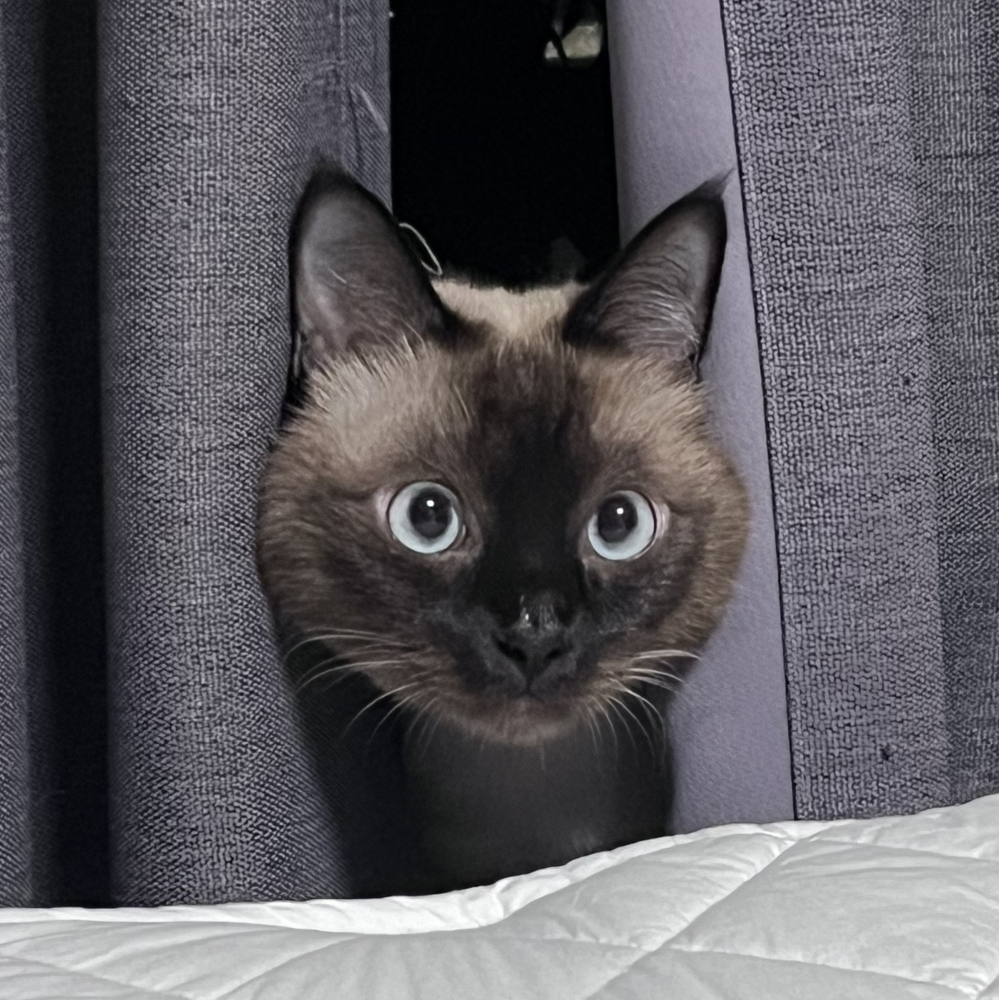
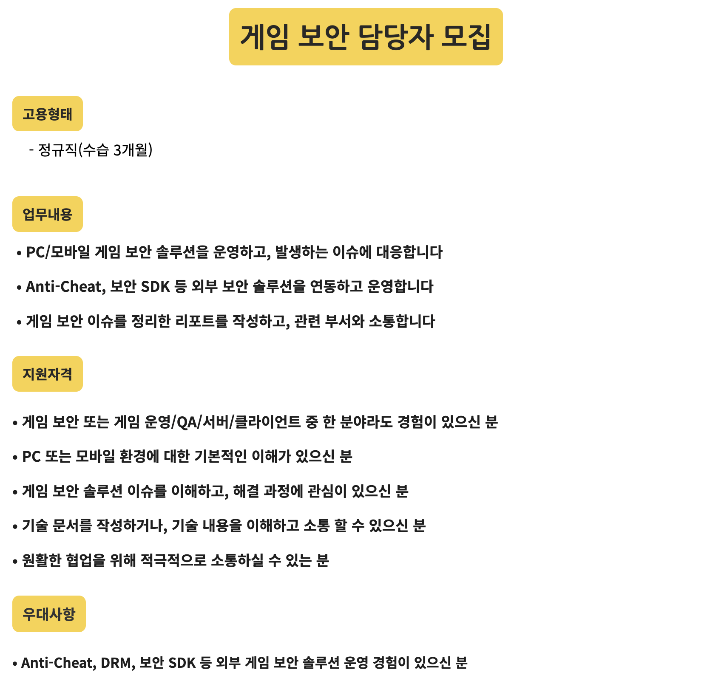
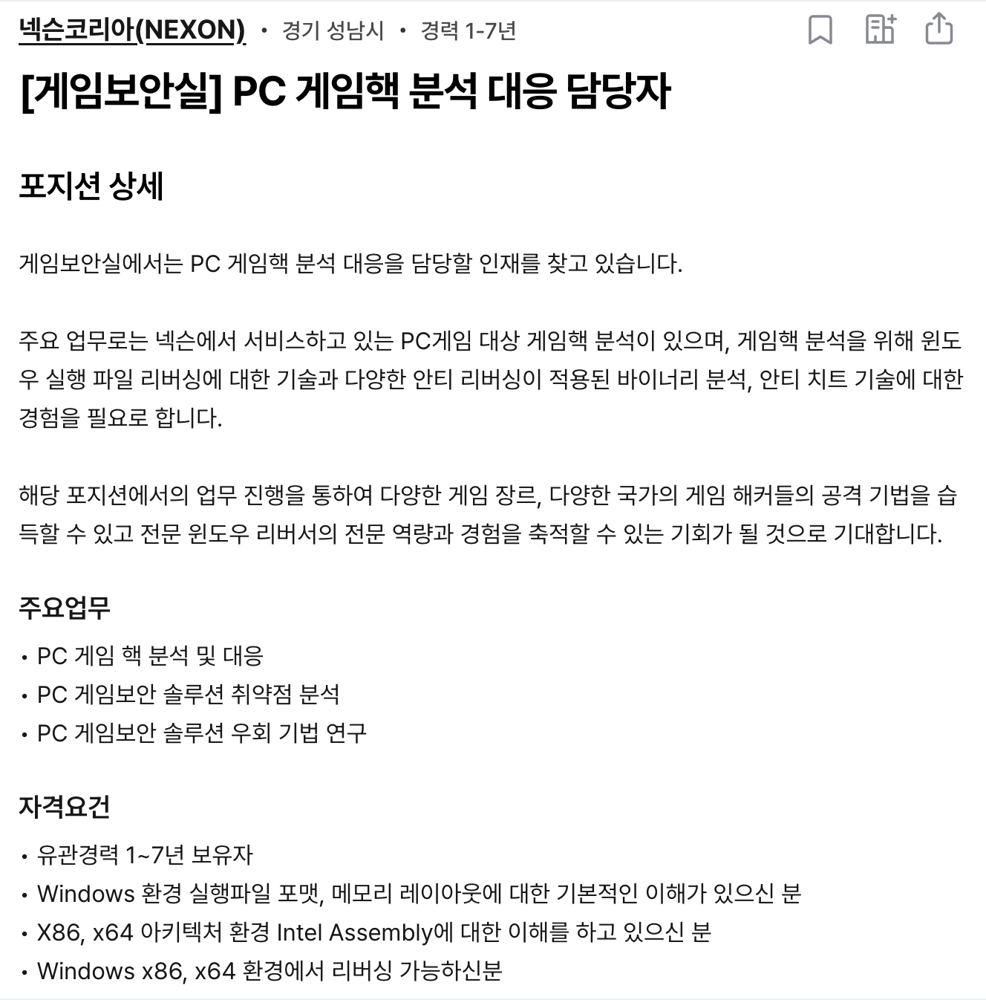
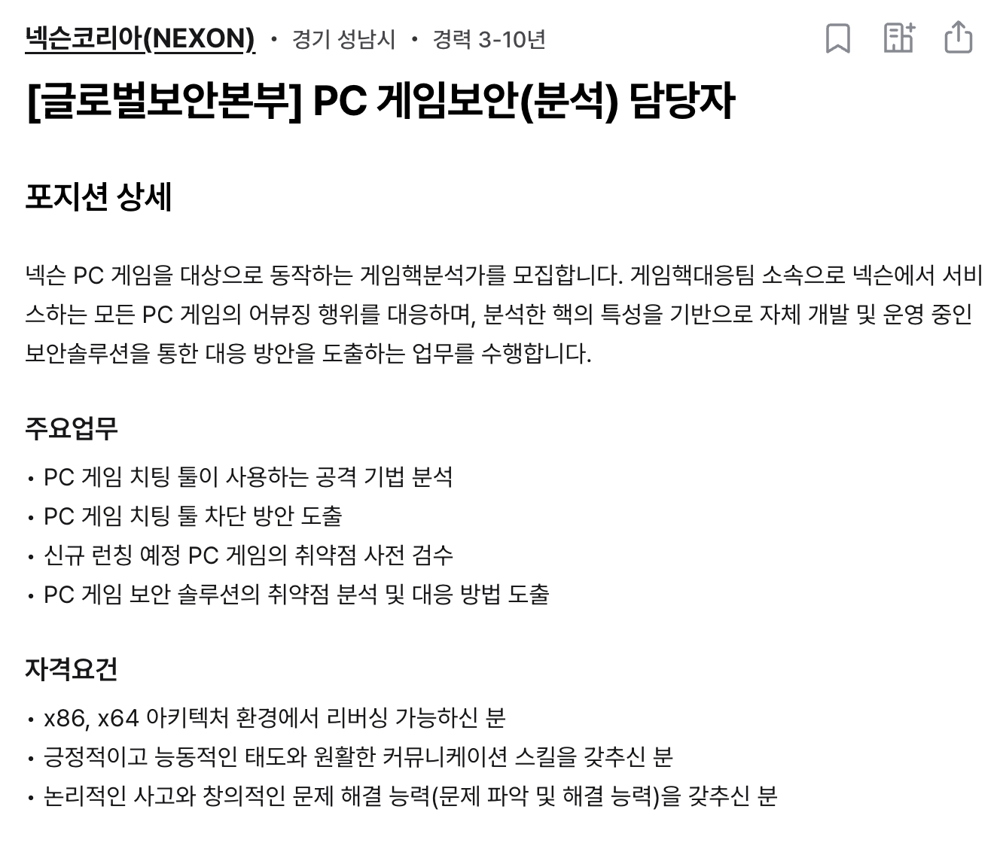
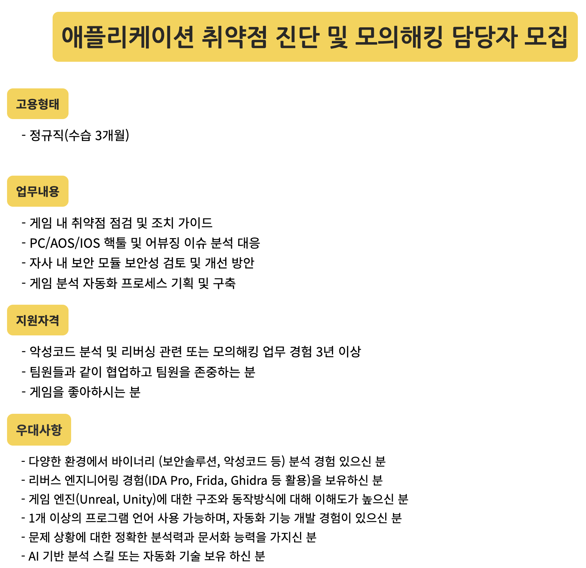
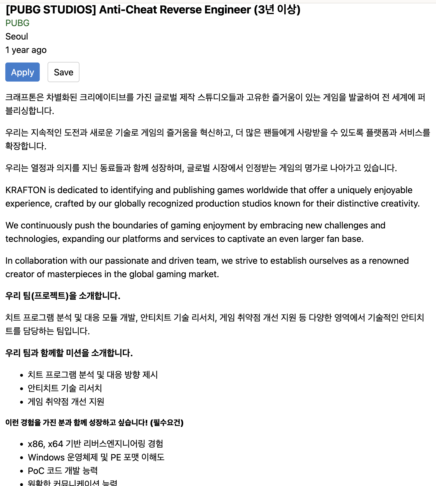

  
  
안녕하세요! v32231의 개인 블로그입니다!

  

  
이름: 박다현

  
닉네임: v32231

  
[GitHub 바로가기](https://github.com/v32231)

 

Experience

### Development
Nothing yet

### CTF/Wargame
- 2023 SecurityFirst 연말 해킹 대회 문제 제작
    - 좋았던 점: CTF 참가 경험도 거의 없었던 때에 선배님들의 도움을 받아가며 대회 운영에 발을 담가볼 수 있어서 좋은 경험이었다. QR코드 관련 문제 내려고 머리싸매고 구글링 했던 기억이 난다.
    - 아쉬운 점: 당시 디지털 포렌식에 관심이 있었는데 실력 부족으로 인해 misc 문제만 만들 수밖에 없었다.
- 2024 순천향대학교 청소년 정보보호 페스티벌(YISF) 문제 제작
    - 좋았던 점: 방학에 공부 열심히 해서 드디어 포렌식 문제를 제작할 기회를 얻었다.
    - 아쉬운 점: 중문제가 0솔브가 났다. 지금 생각해보면 포렌식이 유독 어렵게 출제됐던 것 같다.
- 2024 SecufityFirst 연말 해킹 대회 문제 제작
    - 좋았던 점: 좀 독특한 문제를 낼 수 있는 기회가 됐다.
    - 아쉬운 점: 대회 운영이 좀 많이 아쉬웠던 것 같다.
- 2026 SecufityFirst 연초 해킹 대회 문제 제작
    - 좋았던 점: 처음으로 리버싱 문제를 제작해봤다. AI에게 풀리지 않는 문제를 만들어냈다.
    - 아쉬운 점: AI에게 풀리지 않는 문제는 인간도 못 푼다는 걸 간과했다. 중문제가 0솔브가 나는 과오를 다시 저질렀다.

### BugBounty
Nothing yet

### Blog/Techdocs
- Blog: https://velog.io/@sdfghjk147/posts
    - 좋았던 점: 블로그를 한번 만들어보고 싶었다. 블로그 글 적는게 꽤 재미있었다.
    - 아쉬운 점: 잠깐 시스템 해킹 공부한다고 만든 블로그였는데 다른 공부한다고 어느순간부터 글도 안 쓰고, 방치했다. 끈기가 없었다.

### Paper/Conference
- 2024 .HACK 컴퍼런스 참여
    - 좋았던 점: 세션이 다양해서 체험할 수 있는 게 많았다. 자물쇠 따기나 코드보고 취약점 찾기 이런 게 기억에 남는다.
    - 아쉬운 점: 발표를 한두개 들어는 봤는데 도저히 이해가 안돼서 기억에 남는 게 하나도 없었다. 우주관련된 게 있었던 거 같은데 좀더 실력을 쌓아서 이런 컨퍼런스 발표도 재밌게 들을 수 있는 사람이 되고 싶다.
- 2025 WSP 동계연합세미나 발표 (아주대, 순천향대, 동덕여대 보안 동아리 연합 세미나)
    - (컨퍼런스는 아니지만 세미나 발표는 한 기억이 있어서 적어봤습니다.)
    - 좋았던 점: 솔직히 실력은 안 돼서 Ghidra 사용법을 주제로 가볍게 발표했는데 생각보다 다들 열심히 들어주셔서 감사했다.
    - 아쉬운 점: 평소에도 발표는 잼병인데 너무너무 긴장해서 발표문에서 눈을 땔 수가 없었다. 끝나고 난 뒤 창피해서 바로 집에 가버렸다.

### Contest/Certificate
Nothing yet

 

Career Path

### 나의 가치 우선순위
- 높은 우선순위: 재미, 안정성
- 낮은 우선순위: 연봉, 근무지역

### 희망 회사
- 넥슨
- 넷마블
- 크래프톤

### 희망직무 관련 채용 공고
- [넷마블] 게임 보안 담당자 모집
    - 링크: https://career.netmarble.com/announce/view?anno_id=1741
    
- [넥슨] PC 게임핵 분석 대응 담당자
    - 링크: https://www.wanted.co.kr/wd/207985
    
- [넥슨] PC 게임보안(분석) 담당자
    - 링크: https://www.wanted.co.kr/wd/157146
    
- [넷마블] 애플리케이션 취약점 진단 및 모의해킹 담당자 모집
    - 링크: https://career.netmarble.com/announce/view?anno_id=1698
    
- [크래프톤] Anti-Cheat Reverse Engineer (3년 이상)
    - 링크: https://gamejobs.co/PUBG-STUDIOS-Anti-Cheat-Reverse-Engineer-3%EB%85%84-%EC%9D%B4%EC%83%81-at-PUBG
    

### 필요 역량
1. 리버싱 및 프로그램 분석 능력
2. 게임 보안 취약점 분석 및 대응 능력
3. 핵·어뷰징·비정상 행위 분석 능력

**-> 내가 지금 해야 할 것 1가지**: 게임 핵 분석 능력 경험 쌓기

